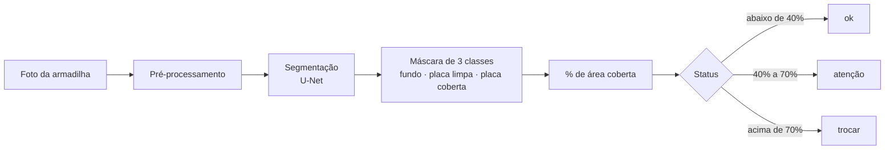
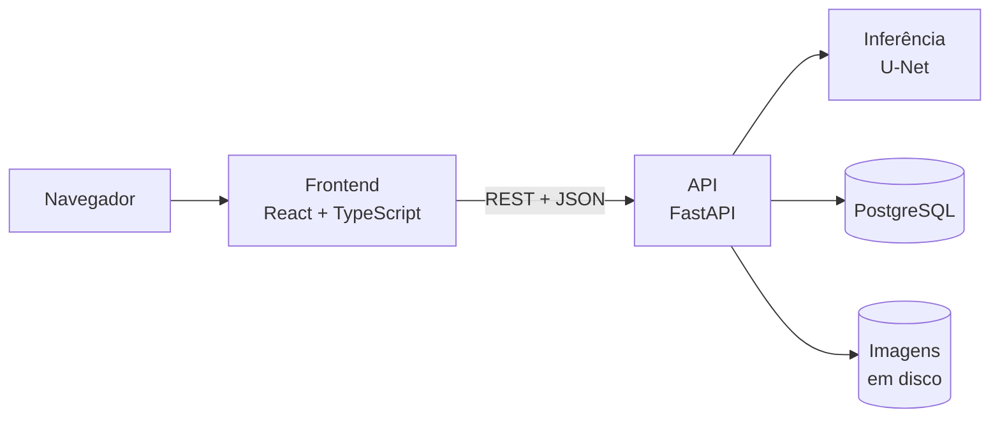

# TrapSight

**Visão computacional para medir a saturação de armadilhas adesivas e prever a hora de trocar o refil.**

O TrapSight analisa a foto de uma armadilha adesiva de mosquito, calcula **quanto da superfície já está coberta por insetos** e **estima em quantos dias ela vai saturar**, trocando a inspeção manual por um critério objetivo.

      

> Projeto Integrador de Sistemas Inteligentes III — Fatec "Shunji Nishimura", Pompeia. **Em desenvolvimento.**

## O problema

Empresas de controle de pragas mantêm armadilhas adesivas em mercados e açougues e decidem a troca do refil por **inspeção visual**, sem critério objetivo. O resultado é um custo duplo:

- **Troca antecipada:** deslocamento da equipe e refil descartado com vida útil sobrando;
- **Troca tardia:** armadilha saturada, sem eficácia no controle de pragas.

O problema foi levantado com uma empresa real do setor, parceira do projeto.

## A solução



Além da leitura pontual, o sistema guarda o histórico de cada armadilha e **projeta quantos dias faltam para a saturação**, permitindo planejar a visita em vez de reagir a ela.

## Funcionalidades

- **Análise por imagem:** upload da foto, máscara de segmentação sobreposta, percentual de cobertura e status;
- **Dashboard operacional:** armadilhas ordenadas por urgência, com painel de alertas;
- **Histórico e projeção:** evolução da cobertura por refil e previsão de dias até a saturação por regressão linear;
- **Timelapse:** reprodução das imagens de um refil sincronizada com o gráfico de evolução;
- **Ciclo de vida do refil:** registro de trocas, com histórico de duração de cada ciclo.

## Arquitetura



Os três serviços (frontend, API e banco) sobem juntos com Docker Compose. O treino do modelo roda fora do container e gera o arquivo de pesos que a API carrega na inicialização.

## Decisões técnicas

| Decisão                                                        | Por quê                                                                                                                          |
| --------------------------------------------------------------- | --------------------------------------------------------------------------------------------------------------------------------- |
| **Medir área coberta em vez de contar insetos**            | Insetos colados se sobrepõem; área é um indicador mais robusto de saturação                                                  |
| **Segmentação em 3 classes** (fundo, placa limpa, placa coberta) | O percentual é calculado sobre a placa detectada, não sobre a imagem inteira; o resultado não depende do enquadramento da foto |
| **Dataset sintético primeiro, dados reais depois**           | Não existe base pública deste cenário; as máscaras nascem junto com a imagem, sem rotulagem manual                            |
| **Avaliação separada em sintético e real**                  | A distância entre as duas métricas mede o *domain gap* e diagnostica se o problema está no gerador ou no modelo              |
| **Baseline clássico (OpenCV) como comparação**              | Mostra com evidência, e não por afirmação, onde o modelo treinado supera um limiar de brilho                                  |
| **Transfer learning** (U-Net com encoder ResNet34 pré-treinado) | Viabiliza o treino com um dataset pequeno                                                                                         |
| **Projeção por regressão sobre todas as medições**          | Usar só a primeira e a última leitura amplifica o ruído de medição                                                           |
| **Regras no banco, não só na aplicação**                      | Restrições, chaves e um índice único parcial garantem no máximo um refil ativo por armadilha, mesmo com acessos concorrentes |
| **Erros padronizados com códigos estáveis**                  | O frontend decide o comportamento pelo código do erro, nunca pelo texto da mensagem                                            |

## Stack

| Camada         | Tecnologia                                                              |
| -------------- | ----------------------------------------------------------------------- |
| Modelo         | Python, PyTorch, `segmentation_models_pytorch`, OpenCV, Albumentations |
| Backend        | FastAPI, SQLAlchemy, Alembic, Pydantic                                  |
| Banco de dados | PostgreSQL                                                              |
| Frontend       | React, TypeScript, Vite, Tailwind CSS, Recharts                         |
| Infraestrutura | Docker, Docker Compose                                                  |
| Qualidade      | Ruff, pytest, ESLint                                                    |

## Status

| Etapa                                                              | Situação      |
| ------------------------------------------------------------------ | ------------- |
| Especificação técnica (arquitetura, modelo, API, telas, avaliação) | Concluída     |
| Ambiente de desenvolvimento e Docker Compose                       | Concluída     |
| Banco de dados (esquema, migrations, regras de integridade)        | Concluída     |
| API (esqueleto, erros padronizados, stub de inferência, projeção) | Em andamento  |
| Interface web (setup concluído; telas em desenvolvimento)         | Em andamento  |
| Gerador de dataset sintético                                       | Não iniciada  |
| Treinamento e avaliação do modelo                                  | Não iniciada  |
| Validação com fotos reais da empresa parceira                      | Não iniciada  |

Ainda não há resultados de modelo para reportar. Eles serão publicados aqui após a avaliação.

## Como executar

Pré-requisito: Docker Desktop.

```bash
# variáveis de ambiente (preencha os placeholders)
cp .env.example .env
cp backend/.env.example backend/.env
cp frontend/.env.example frontend/.env

# sobe banco, API e frontend
docker compose up --build
```

| Serviço   | Endereço                       |
| --------- | ------------------------------ |
| Frontend  | http://localhost:5173          |
| API (docs)| http://localhost:8000/docs     |

Para desenvolver o backend fora do Docker, instale o [`uv`](https://docs.astral.sh/uv/) e use `uv sync`, `uv run ruff check .` e `uv run pytest` na pasta `backend/`. Os testes de integração precisam de um PostgreSQL com as migrations aplicadas (`uv run alembic upgrade head`).

## Documentação

A especificação completa do sistema está em [`.context/`](.context/): visão geral, modelo de dados, contrato da API, telas, pipeline do modelo e critérios de avaliação. O ponto de partida é [`.context/plan/README.md`](.context/plan/README.md).

## Autor

**Pedro Lucas Francisco** — Tecnologia em Sistemas Inteligentes, Fatec Pompeia.
